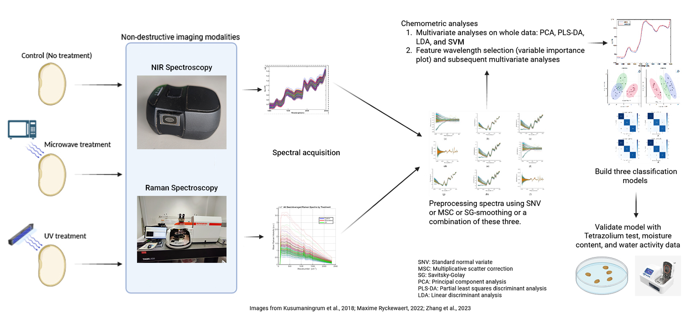

# seed-viability-spectroscopy

## About This Project

Farmers and seed companies want to know: "Will this seed grow?" The usual way to check the seeds' viability, or their ability to grow into a plant, is destructive, i.e., by cutting seeds open to test them or planting one and waiting for it to germinate. 
This project explores a faster, non-destructive alternative method of testing seed viability using cutting edge spectroscopy methods (both expensive and affordable ones) combined with powerful machine learning models. 

In this thesis project, I artificially aged lima bean seeds using microwave and UV exposure to mimic the natural ageing of seeds over time, and compared two spectroscopic techniques—near-infrared spectroscopy and Raman spectroscopy. I built machine learning models and trained them to spot the subtle ageing-related chemical changes on the seeds against a control set (non-aged seeds). 
A handheld portable NIR spectroscope was remarkably good at this job, providing nearly ~98% accuracy in detecting aged seeds from fresh seeds. A simple takeaway from my project would be: A portable NIR spectroscope could give farmers and the agri-food industry a quick and reliable seed quality check without any wastage, improving efficiency and sustainability. 